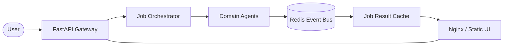
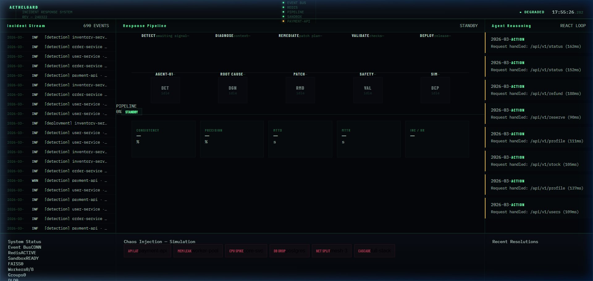
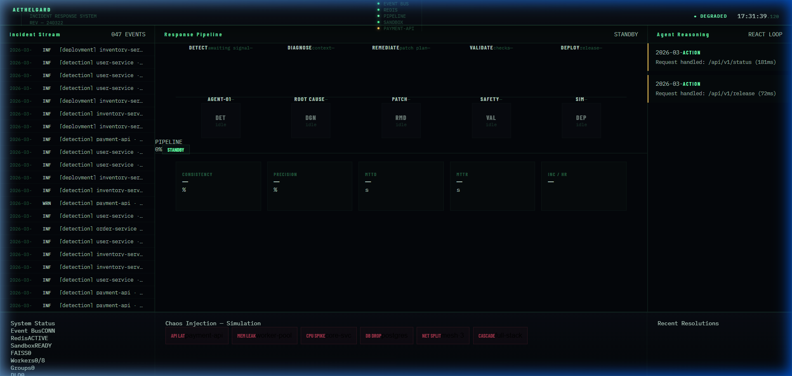

# AETHELGARD

[](https://github.com/RafiDr00/AETHELGARD/actions/workflows/ci.yml)
[](https://github.com/RafiDr00/AETHELGARD)
[](https://www.python.org/downloads/release/python-3120/)
[](https://hub.docker.com/)

> **Live Demo:** 🔗 `[Deploy to Render — see instructions below]`

## Overview
Aethelgard is a distributed, asynchronous agent orchestration system designed for automated incident response and remediation. It provides a robust framework for managing the lifecycle of complex failure-recovery pipelines in production-like environments.

The system solves the problem of "automated operational awareness" by bridging the gap between observability signals and meaningful remedial action. Rather than simple alerting, Aethelgard orchestrates domain-specific agents (Detection, Diagnosis, Remediation, Validation, and Deployment) via a centralized job queue to restore system health autonomously.

Technically, the project explores the intersection of asynchronous task distribution, state-machine based job orchestration, and resilient observability pipelines, making it a robust template for modern site-reliability engineering (SRE) tools.

## Key Capabilities
*   **Job Orchestration:** State-machine based tracking of the multi-stage remediation lifecycle (Pending → Running → Success/Fail).
*   **Async Agent Pipeline:** Non-blocking execution of domain agents using a scalable worker-pool model.
*   **Redis-Backed Durability:** Reliable message passing and job state persistence via Redis.
*   **Failure Recovery:** Built-in retry logic and state consistency checks at every stage of the pipeline.
*   **Live Monitoring Dashboard:** Real-time telemetry visualization using SSE (Server-Sent Events) and precision-engineered UI.
*   **Chaos Resilience Testing:** Native support for simulation-driven chaos injection (latency spikes, memory leaks, etc.) to validate orchestration logic.

## Architecture



## System Design
*   **Async Pipeline:** We leverage Python's asyncio and FastAPI to handle high-concurrency event streams without blocking the main event loop, ensuring the UI remains responsive even during heavy remediation cycles.
*   **Redis Queue:** Redis serves as the backbone for inter-service communication, providing low-latency durable message-passing between the orchestrator and the domain agents.
*   **Agent Separation:** By decoupling agents (Detect, Diagnose, Remediate, etc.), we ensure that the domain logic for "how to fix a service" is independent of the orchestration logic for "how to run a job."
*   **Job Lifecycle Tracking:** Every remediation attempt is assigned a unique job_id, which is audited across every state transition to provide a full transparent trace of the autonomous fix.

## Simulation Layer
Aethelgard uses a transparent simulation layer to model infrastructure anomalies and validate remediation logic without requiring real production infrastructure. These simulations generate realistic synthetic telemetry to test the reliability of the orchestration engine.

**Supported Scenarios:**
*   **Payment Latency Spike:** Models a 2500ms+ delay in the payment processing service.
*   **Dependency Failure:** Simulates a downstream service becoming unreachable.
*   **Service Degradation:** Models gradual resource exhaustion (CPU/Memory) in a core-svc worker.

## Quickstart
```bash
# Clone the repository
git clone https://github.com/RafiDr00/AETHELGARD.git
cd AETHELGARD

# Start the full stack with Docker Compose
docker-compose up --build -d

# Open the dashboard
# http://localhost:8080
```

## API Example
### Run Pipeline
`POST /api/v1/pipeline/run?scenario=payment_latency_spike`

**Request Headers:** `X-API-Key: <your_api_key>`

**Success Response (202 Accepted):**
```json
{
  "job_id": "job_01HMBW7...",
  "status": "pending",
  "scenario": "payment_latency_spike",
  "timestamp": "2024-03-22T17:31:39.282Z"
}
```

## Dashboard
The Aethelgard console provides a high-fidelity visual of the active remediation loop. It visualizes the current pipeline stage, agent reasoning logs, and system metrics in real-time, allowing for live auditing of the autonomous response.

## Tech Stack
*   **Backend:** FastAPI, Python 3.12+
*   **Queue/State:** Redis
*   **Observability:** SSE, OpenTelemetry (Traces)
*   **Deployment:** Docker, Render
*   **Frontend:** Static HTML/JS with Precision CSS

## Project Structure
```text
AETHELGARD/
├── agents/            # Domain-specific agent logic
├── core/              # Orchestration engine and config
├── event_bus/         # Redis-backed messaging 
├── scripts/           # Deployment and testing utilities
├── ui/                # Frontend dashboard (Static)
├── api.py             # FastAPI entry point
├── main.py            # CLI entry point
├── docker-compose.yml # Local orchestration
└── render.yaml        # Render production deployment config
```

## Screenshots


*Dashboard Live Operations Console during an active remediation cycle.*


*Pipeline View Multi-stage agent orchestration workflow status.*

## Walkthrough: Local Orchestration

Follow these steps to experience the end-to-end orchestration flow on your local machine.

### Step 1 — Run a Target Service
Run a simple Flask API container that will serve as our "vulnerable" system.

```bash
docker run -d --name demo-service -p 5000:5000 python:3.12-slim \
sh -c "pip install flask && python - <<EOF
from flask import Flask
app = Flask(__name__)
@app.route('/')
def home(): return 'service running'
app.run(host='0.0.0.0', port=5000)
EOF"
```

Verify it is reachable: `curl http://localhost:5000`

### Step 2 — Start AETHELGARD
Clone and launch the orchestrator stack.

```bash
git clone https://github.com/RafiDr00/AETHELGARD.git
cd AETHELGARD
docker-compose up --build
```
Access the dashboard at **http://localhost:8080**.

### Step 3 — Simulate a Failure
Manually stop the target service to create a real failure signal.

```bash
docker stop demo-service
```

### Step 4 — Trigger Autonomous Response
Command Aethelgard to investigate and remediate the dependency failure.

```bash
curl -X POST "http://localhost:8080/api/v1/pipeline/run?scenario=dependency_failure" \
-H "X-API-Key: test123"
```

Observe the **Response Pipeline** on the dashboard as it detects the stopped service and orchestrates the diagnostic agents.

## Limitations
*   **Synthetic Telemetry:** Metrics and events are generated by a simulator rather than a live production environment.
*   **Single Node Deployment:** The current orchestration engine is designed for single-instance high-availability.
*   **Limited Scenario Library:** A fixed set of 6 simulation scenarios is currently defined.
*   **Reference Implementation:** Designed for architectural demonstration rather than a turnkey production drop-in.

## Future Work
*   **Real Telemetry Ingestion:** Support for Prometheus/Datadog hooks.
*   **Policy Learning:** Using reinforcement learning to optimize remediation strategies over time.
*   **Distributed Scaling:** Horizontally scalable orchestrator nodes with cluster consensus.
*   **Persistent Vector Store:** Migrate the in-memory FAISS index in the RAG engine to a persistent vector database (e.g. Qdrant, Weaviate) for long-term retention.
