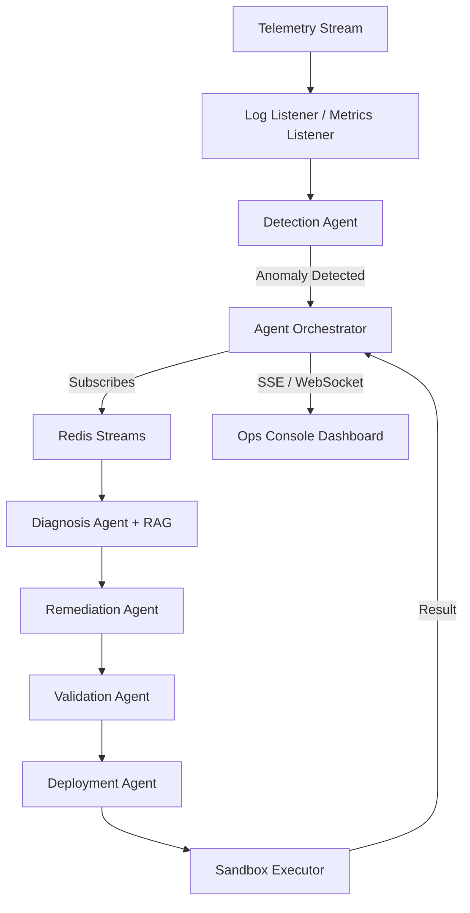

# AETHELGARD

[](https://github.com/RafiDr00/AETHELGARD/actions/workflows/ci.yml)
[](https://www.python.org/downloads/release/python-3120/)
[](https://hub.docker.com/)

> **Autonomous Incident Response & Remediation Engine**
> 
> **Live Demo:** 🔗 [Dashboard](https://rafidr00.github.io/AETHELGARD) · [API](https://aethelgard-api.onrender.com)

## Overview

Aethelgard is a distributed, asynchronous agent orchestration system designed for automated incident response. It bridges the gap between observability signals and remedial action by coordinating specialized AI agents to restore system health without human intervention.

Unlike traditional alerting systems that only notify on failure, Aethelgard executes a full autonomous lifecycle: **Detection → Diagnosis → Remediation → Validation → Deployment**.

## Core Tech Stack

*   **Runtime:** Python 3.12 (Pydantic V2, Asyncio)
*   **API & Streaming:** FastAPI with Server-Sent Events (SSE) for real-time dashboard updates.
*   **Event Bus:** Redis Streams for durable, asynchronous task distribution and consumer groups.
*   **AI/RAG Engine:** FAISS vector store with `sentence-transformers/all-MiniLM-L6-v2` for playbook retrieval.
*   **Observability:** OpenTelemetry (OTLP) instrumentation for tracing and Prometheus for metrics.
*   **Deployment:** Docker-containerized backend on Render; Frontend hosted on GitHub Pages.

## Key Capabilities

*   **State-Machine Orchestration:** Robust tracking of remediation jobs from `PENDING` to `RESOLVED` with automatic failure handling.
*   **Deduplication & Safety:** Intelligent fingerprinting to prevent thundering-herd effects and per-service locks to avoid conflicting remediations.
*   **Hardened Sandbox:** Isolated Docker environment for executing remediation scripts with zero network access and restricted capabilities.
*   **Live Ops Console:** A precision-engineered dashboard visualizing agent reasoning, real-time telemetry, and historical results.
*   **Chaos Engineering:** Native support for simulating failure scenarios (latency spikes, memory leaks, DB drops) to test orchestration resilience.

## Architecture



## Deployment & Development

### Local Setup
1.  Clone the repository and install dependencies:
    ```bash
    pip install -r requirements.txt
    ```
2.  Start Redis and set environment variables:
    ```bash
    export AETHELGARD_API_KEY="test123"
    export REDIS_URL="redis://localhost:6379"
    ```
3.  Run the platform:
    ```bash
    python main.py
    ```

### Cloud Deployment
*   **Backend:** Deployed via `Dockerfile` to Render. Ensure `AETHELGARD_API_KEY` and `REDIS_URL` are set in environment variables.
*   **Frontend:** Standard SPA deployment to GitHub Pages. All API calls target the Render endpoint with CORS authorization.

## License
MIT
